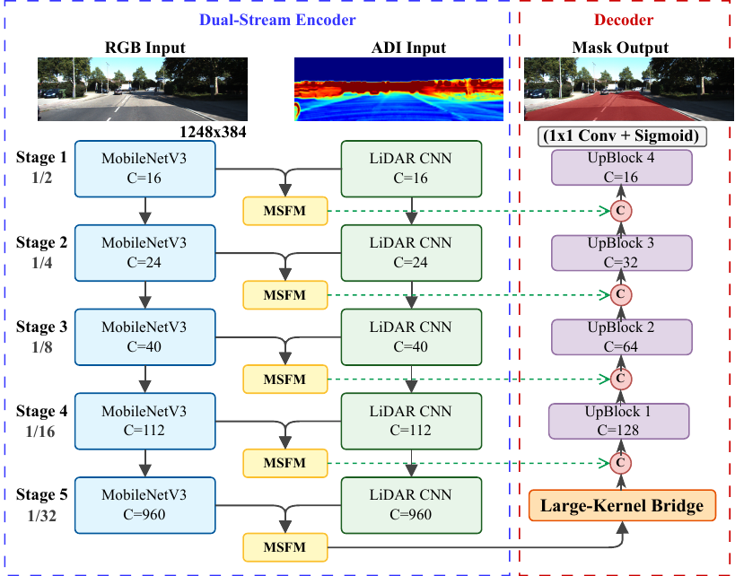
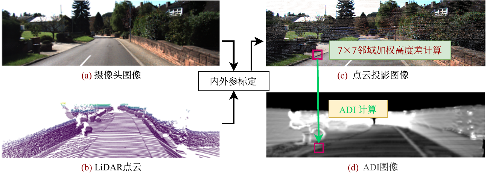
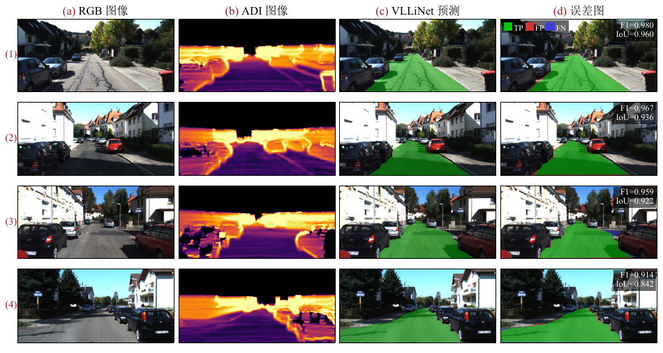
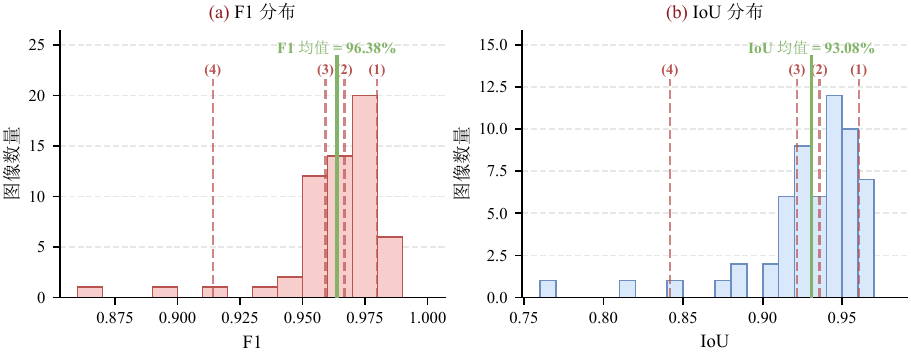

# VLLiNet: Vision-LiDAR Lightweight Integration Network

[](https://www.python.org/)
[](https://pytorch.org/)
[](LICENSE)

**VLLiNet** (Vision-LiDAR Lightweight Integration Network) is a lightweight multi-modal road segmentation network designed for automatic line-marking machines. By fusing RGB images and LiDAR data, it achieves **96.32% MaxF** on the KITTI Road dataset while maintaining **55 FPS** real-time inference with only **14.04M** parameters.

---

## 🎯 Performance Highlights

| Metric | Value |
|--------|-------|
| **MaxF** | **96.32%** |
| **Precision** | **96.79%** |
| **Recall** | **95.85%** |
| **Parameters** | **14.04M** |
| **FPS** | **55** (RTX 4060 Ti) |
| **Encoder** | MobileNetV3-Large + Lightweight LiDAR |

---

## 🚀 Key Features

- **Lightweight Dual-Stream Encoder**: MobileNetV3-Large (5.4M) for RGB + DSConv encoder (0.12M) for LiDAR
- **Multi-Scale Fusion Module (MSFM)**: Cross-modal attention with gated fusion mechanism
- **LargeKernelBridge**: 7×7 large kernel convolution replacing Transformer with linear complexity
- **Deep Supervision**: Multi-scale auxiliary supervision without inference overhead

---

## 🏗️ Network Architecture



**Overall Pipeline**: Dual-stream encoder → Multi-scale fusion → LargeKernelBridge → U-Net decoder

See [docs/ARCHITECTURE.md](docs/ARCHITECTURE.md) for detailed architecture description.

---

## 📦 Installation

### Requirements

- Python 3.8+
- PyTorch 2.0+
- CUDA 11.8+ (for GPU acceleration)

### Setup

```bash
# Clone the repository
git clone https://github.com/yourusername/VLLiNet.git
cd VLLiNet

# Install dependencies
pip install -r requirements.txt
```

### Quick Start

```python
from models import VLLiNet
from demo.inference_demo import load_model, inference

# Load model (weights not included during review)
model = load_model()

# Run inference
pred_mask = inference(model, rgb_image, lidar_points, calib)
```

See [demo/README.md](demo/README.md) for detailed usage.

---

## 📂 Project Structure

```
VLLiNet/
├── models/
│   ├── __init__.py
│   └── vllinet.py              # Network architecture definition
├── utils/
│   ├── __init__.py
│   └── adi_generation.py       # ADI generation from LiDAR
├── demo/
│   ├── inference_demo.py       # Inference interface demo
│   └── README.md
├── docs/
│   ├── ARCHITECTURE.md         # Detailed architecture description
│   └── PERFORMANCE.md          # Performance analysis
├── figures/                    # Architecture diagrams and results
├── requirements.txt            # Python dependencies
├── LICENSE                     # MIT License
└── README.md
```

---

## 📊 Comparison with State-of-the-Art

Performance on KITTI Road official test set:

| Method | Encoder | Input | MaxF | Params | FPS |
|--------|---------|-------|------|--------|-----|
| SNE-RoadSegV2 | Swin-B×2 | RGB+Normal | 97.55% | 205.8M | -- |
| RoadFormer | Swin-T | RGB+Depth | 97.50% | 206.8M | -- |
| USNet | ResNet-18 | RGB+Depth | 96.89% | 30.7M | 44 |
| LRDNet | VGG-19 | RGB+LiDAR | 96.87% | 19.5M | 10 |
| **VLLiNet** | **MobileNetV3-L** | **RGB+LiDAR** | **96.32%** | **14.04M** | **55** |

**Key Advantages**:
- **93.2% fewer parameters** vs. Transformer methods, enabling real-time deployment
- **28% fewer parameters** and **5.5× faster** vs. LRDNet
- High precision (96.79%) with low false positive rate

See [docs/PERFORMANCE.md](docs/PERFORMANCE.md) for detailed performance analysis.

---

## 🖼️ Qualitative Results

### ADI Generation Pipeline


LiDAR point cloud → Camera projection → Neighborhood height difference → ADI grayscale image

### Segmentation Results


Qualitative segmentation results on KITTI Road validation set. From left to right: RGB input, ADI input, prediction, error map (green=TP, red=FP, blue=FN).

### Performance Distribution


Per-image F1 and IoU distribution across 58 validation images (mean MaxF=96.38%).

---

## 📝 Citation

This work is part of a Master's thesis at Shandong University (Chapter 2).

```bibtex
@mastersthesis{wang2026vllinet,
  title={VLLiNet: A Lightweight Multi-Modal Road Segmentation Method for Automatic Line-Marking Machines},
  author={Bingtao Wang},
  school={Shandong University},
  year={2026},
  chapter={2}
}
```

---

## 🙏 Acknowledgments

- **KITTI Dataset**: Thanks to the KITTI team for providing the benchmark dataset
- **MobileNetV3**: Using PyTorch official ImageNet pretrained weights

---

## ⚠️ Important Notice

This work is currently **under journal review**. To protect intellectual property and maintain publication integrity:

- 🔒 **Model weights** are not publicly available
- 🔒 **Core implementation details** (MSFM, fusion strategies) are not disclosed
- 🔒 **Training code** is not released at this time

The figures and performance metrics presented here are for **academic demonstration purposes only**. Full code and pretrained models will be released upon journal acceptance.

---

## 📧 Contact

**Bingtao Wang**
Shandong University
Email: wangbt@mail.sdu.edu.cn

---

**Last Updated**: 2026-03-13
